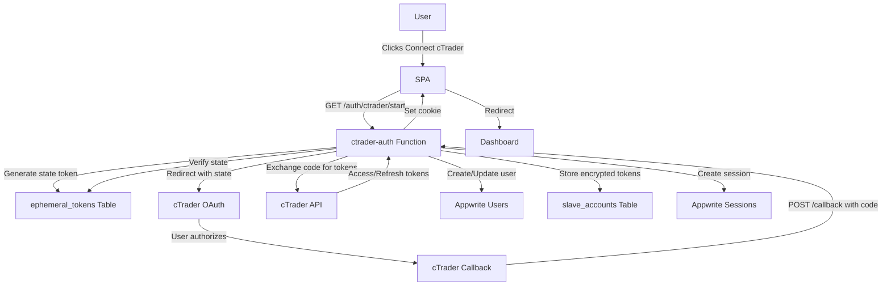
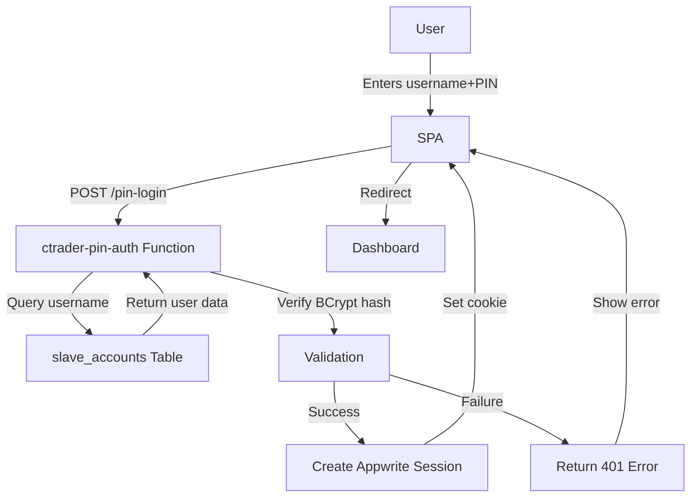
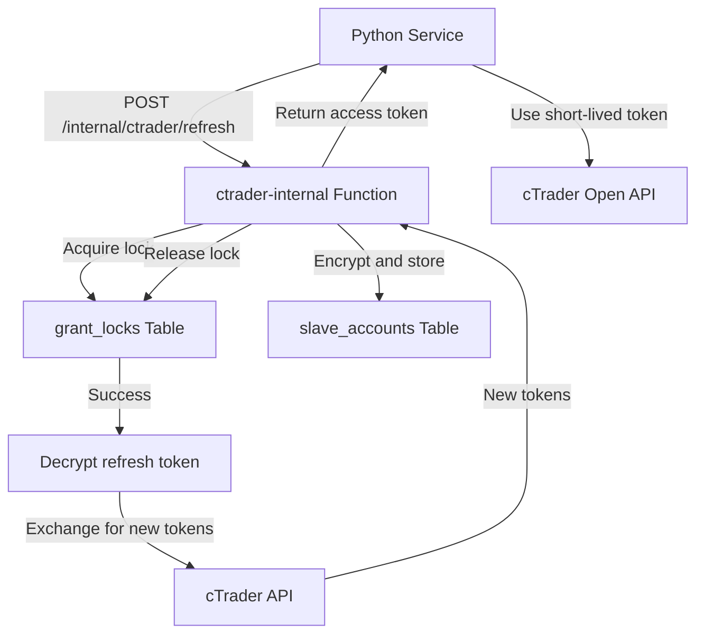
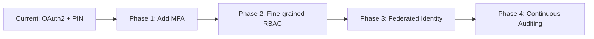

# SSFX v2 Authentication Architecture

## Table of Contents

1. [Authentication Overview](#authentication-overview)
2. [Implemented Authentication Paths](#implemented-authentication-paths)
   - [2.1. OAuth2 with cTrader (Primary Path)](#21-oauth2-with-ctrader-primary-path)
   - [2.2. PIN-Based Authentication (Secondary Path)](#22-pin-based-authentication-secondary-path)
   - [2.3. Master Authentication](#23-master-authentication)
3. [Authentication Flow Diagrams](#authentication-flow-diagrams)
4. [Security Architecture](#security-architecture)
5. [Session Management](#session-management)
6. [Token Management](#token-management)
7. [Recommended Authentication Path](#recommended-authentication-path)
8. [Authentication Component Reference](#authentication-component-reference)
9. [Future Authentication Enhancements](#future-authentication-enhancements)

## Authentication Overview

SSFX v2 implements a multi-layered authentication system designed for secure cTrader copy trading. The architecture supports multiple authentication paths to accommodate different user types and scenarios while maintaining strong security guarantees.

### Key Authentication Principles

1. **Defense in Depth**: Multiple security layers (OAuth, PIN, session management, token encryption)
2. **Least Privilege**: Row-level permissions, role-based access control
3. **Secure by Default**: Encryption at rest, secure cookies, rate limiting
4. **Graceful Degradation**: Fallback mechanisms for token refresh failures
5. **Auditability**: Comprehensive logging and monitoring

### Authentication Components

| Component | Purpose | Technology |
|-----------|---------|-------------|
| `ctrader-auth` Function | OAuth2 flow, session management | Appwrite Functions, Node.js |
| `ctrader-pin-auth` Function | PIN-based authentication | Appwrite Functions, Node.js |
| `ctrader-internal` Function | Server-to-server token refresh | Appwrite Functions, Node.js |
| `slave_accounts` Table | User identities and encrypted tokens | Appwrite TablesDB |
| `ephemeral_tokens` Table | Short-lived tokens (OAuth state, PIN reset) | Appwrite TablesDB |
| `grant_locks` Table | Distributed locks for token refresh | Appwrite TablesDB |
| SPA Session Manager | Client-side session handling | JavaScript, Appwrite Web SDK |

## Implemented Authentication Paths

### 2.1. OAuth2 with cTrader (Primary Path)

**Purpose**: Primary authentication method for new users connecting their cTrader accounts

**Flow Diagram**:
```
User → SPA → ctrader-auth/start → cTrader OAuth → /callback → 
Appwrite User Creation → slave_accounts Row → Session Cookie → Dashboard
```

**Detailed Steps**:

1. **Initiation**: User clicks "Connect cTrader" in SSFX HQ SPA
2. **State Generation**: `ctrader-auth/start` generates HMAC-signed state token
3. **Token Storage**: State token stored in `ephemeral_tokens` table with 10-minute expiry
4. **Redirect**: User redirected to cTrader OAuth consent page with state parameter
5. **Authorization**: User grants access to requested scopes
6. **Callback**: cTrader redirects to `/callback` with authorization code
7. **State Verification**: Function verifies state token matches stored value
8. **Token Exchange**: Function exchanges code for access/refresh tokens via cTrader API
9. **User Creation**: Creates/updates Appwrite user if not exists
10. **Grant Storage**: Creates/updates `slave_accounts` row with:
    - AES-GCM-256 encrypted access token
    - AES-GCM-256 encrypted refresh token
    - Token expiry timestamp
    - Grant ID (opaque handle)
    - User metadata
11. **Session Creation**: Creates Appwrite session with secure cookie
12. **Redirection**: Redirects user to dashboard with session cookie

**Security Features**:
- HMAC-signed state tokens prevent CSRF
- Rate limiting (10 requests/minute) on OAuth start endpoint
- Short-lived state tokens (10-minute expiry)
- AES-GCM-256 encryption for tokens at rest
- HTTP-only, Secure, SameSite=Lax session cookies

**Code Location**: `functions/ctrader-auth/src/main.js`

### 2.2. PIN-Based Authentication (Secondary Path)

**Purpose**: Alternative authentication for existing users, password recovery, and master access

**Flow Diagram**:
```
User → SPA → /pin-login → slave_accounts Verification → 
Appwrite Session → Session Cookie → Dashboard
```

**Detailed Steps**:

1. **Credential Entry**: User enters username + PIN in SPA login form
2. **Request**: SPA calls `POST /pin-login` with credentials
3. **Validation**: Function verifies:
    - Username exists in `slave_accounts`
    - PIN hash matches stored BCrypt hash
    - Account status is 'active'
4. **Session Creation**: Creates Appwrite session on successful validation
5. **Response**: Returns session cookie to SPA
6. **Redirection**: SPA stores cookie and redirects to dashboard

**Additional Endpoints**:

- **Set Credentials**: `POST /set-credentials` - New users set username + PIN after OAuth
- **PIN Reset Request**: `POST /pin-reset/request` - Generates reset token, sends email via Resend
- **PIN Reset Confirm**: `POST /pin-reset/confirm` - Validates token and sets new PIN

**Security Features**:
- BCrypt password hashing (12 rounds)
- Rate limiting on login attempts
- Email-based PIN reset with short-lived tokens
- No plaintext PIN storage

**Code Location**: `functions/ctrader-pin-auth/src/main.js`

### 2.3. Master Authentication

**Purpose**: Administrative access for monitoring all slave accounts

**Special Configuration**:
- Master username: `admin` (configured via `init-scripts/admin-pin.sh`)
- Master role stored in `service_config` table with key `master_auth`
- Access to `/admin/slaves` endpoint in `ctrader-auth` function

**Flow**:
1. Master uses PIN authentication with `admin` username
2. Function checks `service_config` for master role validation
3. On successful login, master gains access to:
   - All slave account listings
   - Master dashboard with aggregated views
   - Account monitoring and management

**Security**:
- Master PIN set separately from regular users
- Role-based access control enforced at function level
- No direct database access for master operations

## Authentication Flow Diagrams

### OAuth2 Flow (Primary Path)



### PIN Authentication Flow (Secondary Path)



### Token Refresh Flow (Background)



## Security Architecture

### Cryptographic Protections

| Data | Protection Mechanism | Implementation |
|------|---------------------|----------------|
| cTrader Tokens | AES-GCM-256 encryption | `functions/_shared/index.js` |
| OAuth State | HMAC-SHA256 signing | `functions/ctrader-auth/src/main.js` |
| PINs | BCrypt hashing (12 rounds) | `functions/ctrader-pin-auth/src/main.js` |
| Session Cookies | HTTP-only, Secure, SameSite | Appwrite SDK defaults |
| Distributed Locks | SHA-256 hashed row IDs | `functions/ctrader-internal/src/main.js` |

### Rate Limiting

- **OAuth Start**: 10 requests/minute per IP
- **PIN Login**: 5 attempts before temporary lockout
- **Token Refresh**: Distributed locking prevents concurrent refreshes

### Input Validation

- All endpoints validate input parameters
- SQL injection prevention via parameterized queries
- XSS prevention via output encoding in SPA

### Audit Logging

- All authentication events logged with timestamps
- Failed attempts logged with IP addresses
- Token refresh operations logged
- Session creation/destruction logged

## Session Management

### Session Lifecycle

1. **Creation**: On successful OAuth or PIN authentication
2. **Storage**: Appwrite session with secure cookie
3. **Validation**: `GET /session` endpoint checks cookie validity
4. **Destruction**: `POST /logout` clears cookie and Appwrite session
5. **Expiry**: Configurable session timeout (default: 24 hours)

### Cookie Configuration

```javascript
{
  name: `a_session_${PROJECT_ID}`,
  httpOnly: true,
  secure: true,  // HTTPS only
  sameSite: 'Lax',
  path: '/',
  maxAge: 86400  // 24 hours
}
```

### Session Validation Flow

1. SPA calls `GET /session` on page load
2. Function validates Appwrite session cookie
3. Returns `{ authenticated: true, userId: '...' }` on success
4. Returns `{ authenticated: false }` on failure
5. SPA redirects to login if session invalid

## Token Management

### Token Types

| Token Type | Purpose | Lifetime | Storage |
|------------|---------|----------|---------|
| Access Token | cTrader API calls | 1 hour | Encrypted in DB |
| Refresh Token | Obtain new access tokens | 30 days | Encrypted in DB |
| OAuth State | CSRF protection | 10 minutes | ephemeral_tokens table |
| PIN Reset | Password recovery | 15 minutes | ephemeral_tokens table |
| Session Cookie | User authentication | 24 hours | Browser cookie |

### Token Refresh Process

1. **Trigger**: Access token expired or near expiry
2. **Lock Acquisition**: Distributed lock prevents concurrent refreshes
3. **Decryption**: Decrypt stored refresh token
4. **Exchange**: Call cTrader API with refresh token
5. **Encryption**: Encrypt new access/refresh tokens
6. **Storage**: Update `slave_accounts` table
7. **Release**: Free distributed lock
8. **Return**: Provide new access token to caller

### Scheduled Token Refresh

- **Cron Schedule**: Daily at 03:00 UTC
- **Function**: `ctrader-token-refresh-worker`
- **Purpose**: Proactively refresh near-expiry tokens
- **Buffer**: 2 hours before expiry

## Recommended Authentication Path

### Primary Path: OAuth2 with cTrader

**Why Recommended**:
- ✅ Most secure (OAuth2 standard)
- ✅ No password management required
- ✅ Automatic token refresh
- ✅ Direct cTrader account linking
- ✅ Audit trail via cTrader

**Use Cases**:
- New user onboarding
- Adding additional cTrader accounts
- Re-authentication after token expiry

**Implementation Steps**:

1. **Frontend**: Use `AuthAPI.startOAuth()` in SPA
2. **Backend**: Ensure `ctrader-auth` function deployed
3. **Configuration**: Set cTrader OAuth credentials in function variables
4. **Redirect**: Configure cTrader OAuth callback to `auth.mrme.tech/callback`

### Secondary Path: PIN Authentication

**When to Use**:
- Existing users after initial OAuth setup
- Password recovery scenarios
- Master/admin access
- Environments where OAuth is unavailable

**Implementation Steps**:

1. **Frontend**: Use `AuthAPI.pinLogin()` in SPA
2. **Backend**: Ensure `ctrader-pin-auth` function deployed
3. **Setup**: Users must first set PIN via `/set-credentials` after OAuth
4. **Recovery**: Implement PIN reset flow for lost credentials

### Not Recommended: Direct API Key Authentication

**Why Avoid**:
- ❌ No user context
- ❌ No audit trail
- ❌ Long-lived credentials
- ❌ Difficult to revoke

## Authentication Component Reference

### Functions

| Function | Endpoints | Purpose |
|----------|-----------|---------|
| `ctrader-auth` | GET `/auth/ctrader/start`, GET `/callback`, GET `/session`, POST `/logout`, GET `/admin/slaves` | OAuth2 flow, session management, master operations |
| `ctrader-pin-auth` | POST `/pin-login`, POST `/set-credentials`, POST `/pin-reset/request`, POST `/pin-reset/confirm` | PIN-based authentication and recovery |
| `ctrader-internal` | POST `/internal/ctrader/refresh`, GET `/internal/grant/latest`, POST `/internal/grant/:grant_id/accounts` | Server-to-server token operations |
| `ctrader-token-refresh-worker` | Cron-triggered | Scheduled token refresh |

### Database Tables

| Table | Purpose | Key Fields |
|-------|---------|------------|
| `slave_accounts` | User identities and tokens | `appwrite_user_id`, `grant_id`, `access_token_enc`, `refresh_token_enc`, `pin_hash` |
| `ephemeral_tokens` | Short-lived tokens | `token_type`, `token_data`, `expires_at` |
| `grant_locks` | Distributed locking | `$id` (grant_id hash), `locked_until` |
| `service_config` | System configuration | `config_key`, `config_value` (master_auth, ctrader_oauth) |

### SPA Components

| Component | Location | Purpose |
|-----------|----------|---------|
| `AuthAPI` | `sites/ssfx-hq/js/api.js` | Authentication API client |
| `LoginComponent` | `sites/ssfx-hq/js/components/login.js` | Login UI and flow |
| `OnboardingComponent` | `sites/ssfx-hq/js/components/onboarding.js` | Post-OAuth PIN setup |
| `SessionManager` | `sites/ssfx-hq/js/auth.js` | Session state management |

## Future Authentication Enhancements

### Planned Improvements

1. **Multi-Factor Authentication**
   - TOTP support for master accounts
   - WebAuthn for hardware key authentication
   - Backup code generation

2. **Enhanced Session Management**
   - Session activity monitoring
   - Concurrent session detection
   - IP-based anomaly detection

3. **Fine-Grained Permissions**
   - Per-account trading permissions
   - Read-only vs full-access roles
   - Temporary access tokens

4. **Security Auditing**
   - Comprehensive audit logs
   - Exportable security reports
   - Automated anomaly detection

5. **Federated Identity**
   - Google/OAuth2 social login
   - Enterprise SSO integration
   - SAML support

### Architecture Evolution



## Conclusion

The SSFX v2 authentication architecture provides a robust, multi-layered security model that balances usability with strong protections. The **recommended authentication path is OAuth2 with cTrader**, which offers the best combination of security, usability, and auditability. PIN authentication serves as a secure secondary method for existing users and recovery scenarios.

### Key Takeaways

1. **Use OAuth2 for new users**: Most secure and auditable method
2. **PIN for existing users**: Convenient secondary authentication
3. **Never use direct API keys**: Lack user context and audit trail
4. **Leverage existing components**: All authentication building blocks are implemented
5. **Follow security best practices**: Encryption, rate limiting, and secure cookies are already configured

For implementation details, refer to the specific function and component documentation in the codebase.